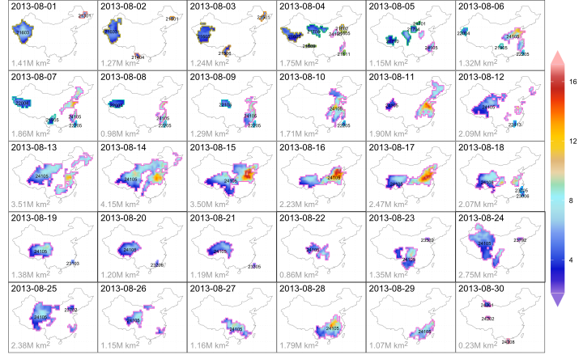

# ST3D

> Visualization for ST3D events

<!-- badges: start -->
[](https://github.com/rpkgs/ST3D.R/actions/workflows/R-CMD-check.yaml)
[](https://app.codecov.io/gh/rpkgs/ST3D.R)
<!-- [](https://cran.r-project.org/package=ST3D.R) -->
<!-- [](https://www.rpackages.io/package/ST3D.R) -->
<!-- [](https://www.rpackages.io/package/ST3D.R) -->
<!-- badges: end -->


## Installation

You can install the development version of `ST3D.R` like so:

``` r
remotes::install_github("rpkgs/ST3D.R")
```

## Example

This is a basic example which shows you how to solve a common problem:

``` r
library(ST3D.R)
## basic example code
```



## TODO

- [ ] Julia调用，实现实时绘图
- [ ] 叠加影响分析
